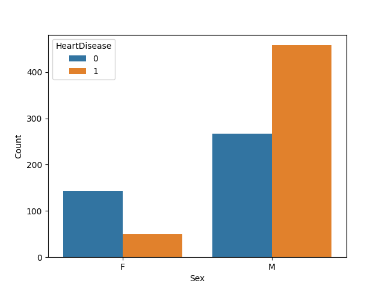

# Applied Machine Learning

Welcome to my personal collection of machine learning algorithms and practical implementations. This repository serves as my hands-on laboratory for understanding fundamental ML models from the ground up, applying them to real-world datasets, and building practical solutions.

## Featured Algorithms & Topics

Here are the core machine learning algorithms and concepts covered in this repository:

* **Linear Regression** — Modeling continuous outcomes, loss functions, and gradient descent.
* **Logistic Regression** — Binary and multi-class classification, decision boundaries, and sigmoid activation.
* **K-Nearest Neighbors (KNN)** — Distance metrics, instance-based learning, and hyperparameter tuning (k).
* **Support Vector Machines (SVM)** — Linear/non-linear classification, margins, and kernel tricks.
* **Decision Trees** — Splitting criteria (Gini Impurity, Information Gain), tree pruning, and decision paths.
* **ML Foundations** — Data preprocessing, feature scaling, model evaluation metrics (Confusion Matrix, Precision/Recall, ROC-AUC), and train-test splitting.

---

## Repository Structure

Each algorithm directory typically includes:
1. **Core Concept/Notes:** Conceptual breakdown and math behind the model.
2. **Implementation/Code:** Clean Python scripts or Jupyter Notebooks implementing the model using libraries like `scikit-learn`, `numpy`, and `pandas`.
3. **Mini-Project:** A small real-world application or dataset exploration demonstrating the algorithm in action.

---

## Getting Started

To run any of the notebooks or scripts locally:

1. **Clone the repository:**

```bash
git clone https://github.com/Uday2356/Applied-machine-learning.git
cd Applied-machine-learning
```

2. **Set up your environment:**

```bash
pip install numpy pandas scikit-learn matplotlib seaborn
```

---

## Project Visuals

These images are stored inside the repository and render correctly in GitHub when referenced with relative paths.

<p align="center">
  
</p>

<p align="center">
  
</p>

<p align="center">
  
</p>

<p align="center">
  
</p>

<p align="center">
  
</p>

---

## Notes

- Use a stable internet connection for running notebooks and loading datasets.
- If you want to extend the project, feel free to add new ML models, experiments, or notebooks.
